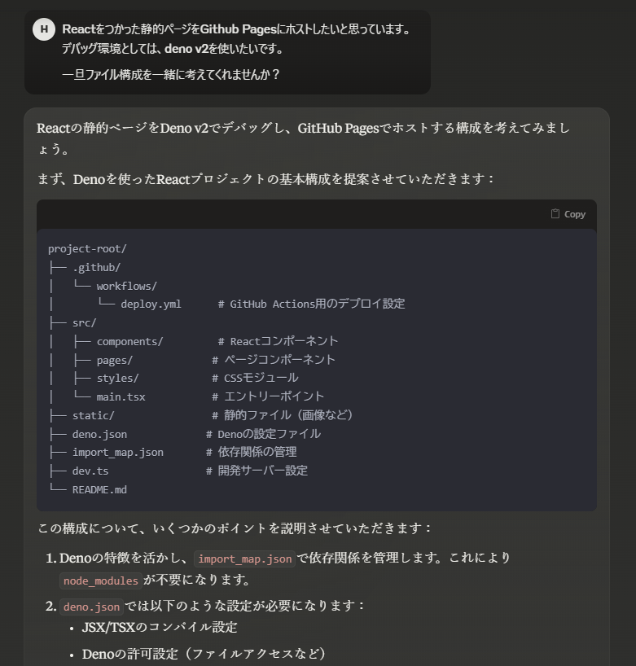

# GitHub Pagesでブログを書く環境を構築した

## なんでブログを書こうと思ったのか

人間はすべからくブログを書くべきである！これは宇宙の真理であり、絶対法則だ。いや、まあ、そこまで大げさな話ではないけど、ブログを書くことには色々とメリットがある。

なぜ人間はブログを書くべきなのかについては、真に驚くべき説明を思いついたのだが、ここに記すには余白が狭すぎる。嘘です、そのうち書きます。

ともあれ、自分の考えを整理するためにも、知見をシェアするためにも、ブログを書くのは良いことだ。そういうわけで、今回ブログを書く環境を整えてみた。

## 環境構築するまでの意思決定

環境構築には色々な選択肢があったが、最終的に以下のような構成にした。

- **Deno + React + React Router** で構築
  - 職場ではNode.jsを使っているので、せっかくだからDenoを試したかった。
  - フロントエンドのデファクトスタンダードはReactなので、やっぱりこれを選択。
  - Next.jsは個人的にあまり好きじゃない（アンチというほどでもないが）、それに他のフレームワークを触ったことがなかったので、React Routerを採用。

- **お金を払いたくないのでGitHub Pagesを利用**
  - 独自ドメインは維持コストがめんどくさい。
  - Cloudflare Pagesも考えたけど、QiitaやZennの記事を読んでいて、最初に解像度が上がったのがGitHub Pagesだった。
  - まあ、無料で運用できるならそれに越したことはない。

## 環境構築するまで

最近はLLM（大規模言語モデル）を活用すると、環境構築が爆速になる。

- **Claude 3にファイル構成を提案させた**
  - 
  - これがなかなか良い感じで、手作業で考えるよりも楽だった。

- **とりあえず動くまでのテンプレコードをAIに書かせた**
  - ChatGPTやGitHub Copilotも駆使。
  - Claudeにはメインの流れを考えさせ、Copilotにはエラー修正や細かい説明をさせる。
    - こうすることで、Claudeに逐一コンテキストを説明しなくて済むので効率的。
    - ただし、Copilotは使いこなせなかったので、最終的にChatGPTに助けを求めた。
      - AIエージェントをうまく扱うのは意外と難しい。
      - 最新技術についていけなくなっている気がして、少し焦る……。

## ブログを書くまで

さて、環境構築が終わったので、いよいよブログを書く。

- マークダウンで下書きを作成。
- それをLLM（ChatGPTなど）に要約・整理してもらう。
- 最後に自分で校正。

こんな感じで書いてみることにした。

技術ブログをアウトプットすることで、自分の理解も深まり、他の人にも役立つ情報が届けられるはずだ。果たしてこの方法がうまく機能するのかは、今後の運用次第。とりあえずは、アウトプットすることが大事！

