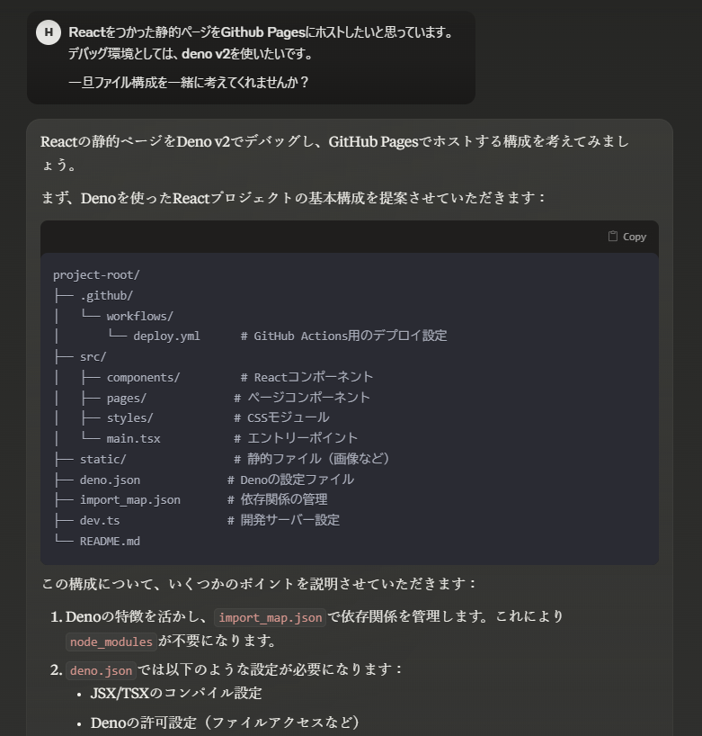

# GitHub Pagesでブログを書く環境構築をした

## なんでブログ書こうと思ったのか

- 人間はすべからくブログを書くべきだ！だから私も書く
  - なぜ人間はブログを書くべきなのか。この主張について真に驚くべき説明を思いついたがここに記すには余白が狭すぎる
    - 嘘です。これはまた別頁で書きたいね

## 環境構築するまでの意思決定

- Deno + React + React Routerで構築
  - 職場ではNode使っているのでDeno試したい
  - Reactがフロントでデファクトスタンダードなので習熟したい
  - Nextアンチだが、他のフレームワーク使ったことなかったのでReact Router使おう
- お金払いたくないので、とりあえずGithub Pagesがいいかな
  - ドメインは結構維持コストがめんどい
  - Cloudflareはありかも。でもQiitaとかZenn読んでて先に解像度あがったのはGithub Pages

## 環境構築するまで

- LLM使って構築するとマジで便利
  - Claude 3にファイル構成提案させた
    - 
- とりあえず動くまでのテンプレコードも書かせることに成功
  - ChatGPTとかGithub Copilotも駆使した
  - Claudeはメインストリームを、Copilotとかはエラー修正とか説明をやらせた
    - こうするとClaudeにコンテクストをいちいち再説明しなくてすむので便利
    - 一方Copilotなんか使いこなせないのでChatGPTに逃げた
      - AIエージェント難しい
      - 最新のテクノロジーについていけない古い人間になりつつある...

## ブログ書くまで

- マークダウンで下書き書いてLLMにまとめてもらって、最後に公正するという感じでやってみた
